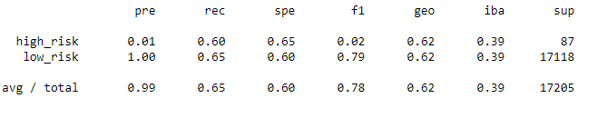
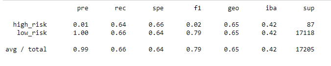
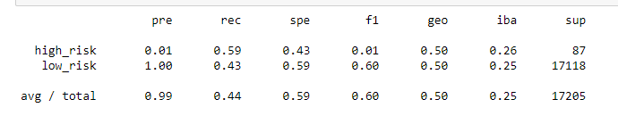
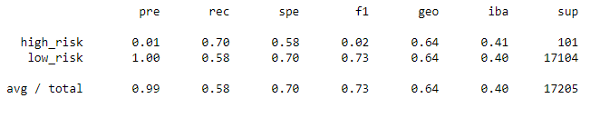
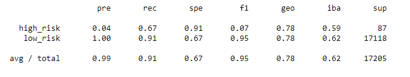
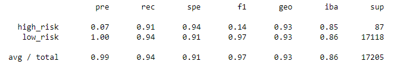

# Credit_Risk_Analysis

# Overview of the analysis: 
    The anaylsis is to review the different machine learning models to determine predictions for risky loans. 

# Results: 

    The Naive Random Sampling report 

Smote Oversampling report

Undersampling report 

Combination sampling report 

Balanced Random Forest report

Easy Ensemble AdaBoost Report

# Summary: 
    There were slight variations in the different models. There were no significant changes between the models resulting in poor predictions for loan holder outcomes. 